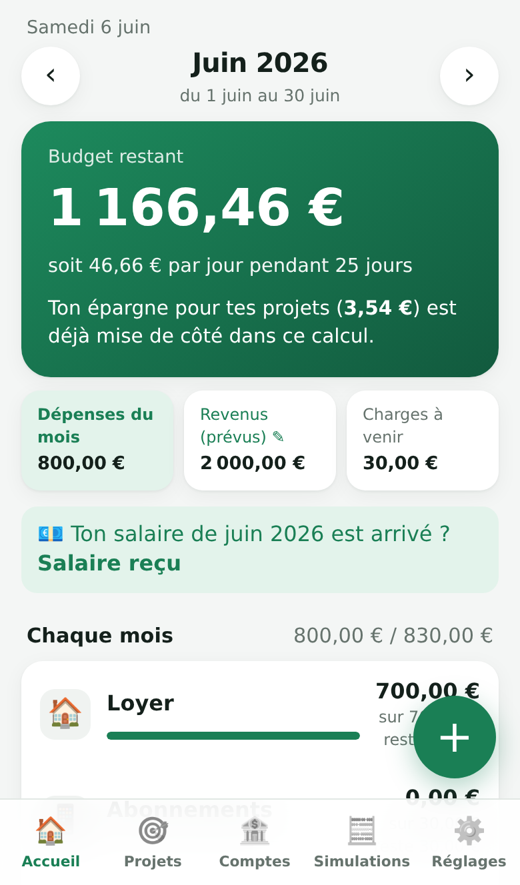
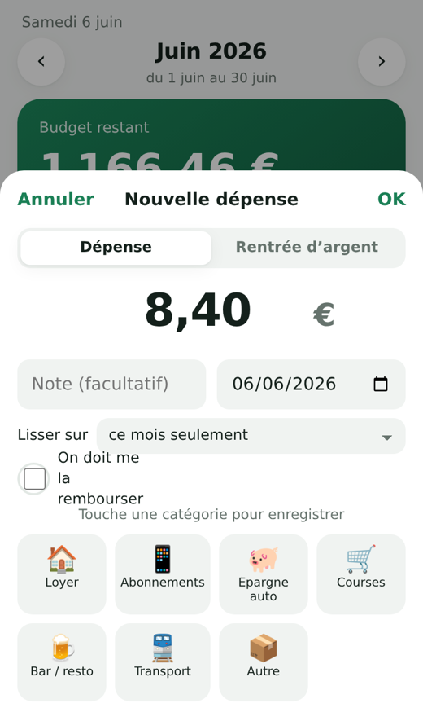
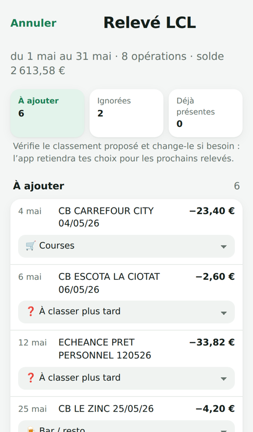

# Mon Budget

Une petite application de budget, simple et rapide, pour iPhone et Mac (et n'importe quel navigateur).
Chacun crée son compte et ne voit que ses propres données : tu peux la partager avec tes amis.

<p>
  
  
  
</p>

## Ce qu'elle fait

- **Accueil** : la date du jour, ton **budget restant** du mois (ce que tu peux encore dépenser une fois tes charges fixes et ton épargne mises de côté), tes **dépenses du mois**, et tes catégories avec ce qu'il reste dans chacune.
- **Mois de budget d'une paie à la suivante** : salaire le 26 ? Ton budget de septembre va du 26 août au 25 septembre. Si la paie arrive un autre jour, « Salaire reçu » (ou l'import du relevé) démarre le mois au bon jour.
- **Paiements Apple Pay ajoutés tout seuls** grâce à un raccourci iPhone, avec une notification : « 18,00 € → Bar / resto · il te reste 140,00 € ce mois-ci », et une alerte si une catégorie dépasse son budget.
- **Import des relevés bancaires** (PDF au format LCL, ou export CSV) : classement automatique des commerçants courants, virements entre tes comptes ignorés, salaire détecté, doublons avec l'iPhone évités, solde du compte mis à jour. L'app retient tes corrections.
- **Ajout à la main en 3 secondes** : le montant, puis une touche sur la catégorie.
- **Dépenses lissées** sur plusieurs mois (un billet à 90 € sur 3 mois = 30 € par mois) et **remboursements attendus** (l'avance ne compte pas ; à son retour, l'argent va en épargne ou dans le budget du mois, au choix).
- **Charges fixes automatiques**, **projets d'épargne** avec objectif mensuel recalculé, **comptes** (Livret A, PEL…), **simulations** (épargne, prêt, objectif) et **comparaison entre les mois**.
- **Assistant de démarrage** pour chaque nouvel utilisateur : revenus → charges fixes → budgets → épargne.
- **Synchronisation en direct** entre tous tes appareils, **fonctionne hors connexion**, sauvegarde et import en un fichier.

Ce qu'elle ne fait pas : se connecter directement à ta banque (il faudrait un agrément DSP2 et un prestataire payant). Le raccourci couvre les paiements sans contact avec l'iPhone ; le reste arrive avec l'import du relevé.

---

## Installation (une seule fois, environ 15 minutes)

L'app est un site web statique hébergé gratuitement sur GitHub Pages ; les données sont dans une base Supabase (offre gratuite).

### 1. Créer la base Supabase

1. Crée un compte sur [supabase.com](https://supabase.com) puis **New project**. Choisis une région en Europe (par exemple Paris ou Francfort) et note le mot de passe de la base quelque part.
2. Dans le projet : **SQL Editor** → **New query** → colle tout le contenu de [`schema.sql`](schema.sql) → **Run**. Tu dois voir « Success ».
3. **Project Settings** → **API Keys** : copie la **Project URL** et la clé **publishable** (`sb_publishable_…`). Sur un projet plus ancien, c'est la clé **anon public**.
   Ne copie jamais la clé *secret* / *service_role*.

### 2. Mettre l'app en ligne avec GitHub Pages

1. Ouvre [`config.js`](config.js) dans GitHub (crayon « Edit ») et colle l'URL et la clé :
   ```js
   export const SUPABASE_URL = 'https://xxxxxxxx.supabase.co';
   export const SUPABASE_KEY = 'sb_publishable_xxxxxxxx';
   ```
   Ces deux valeurs sont faites pour être publiques : ce sont les règles de sécurité de la base qui protègent les données.
2. Dans le dépôt : **Settings** → **Pages** → *Build and deployment* : **Deploy from a branch**, branche **main**, dossier **/ (root)** → **Save**.
3. Après une minute, l'app est en ligne à l'adresse `https://<ton-pseudo>.github.io/<nom-du-dépôt>/`.
4. Retour dans Supabase : **Authentication** → **URL Configuration** → mets cette adresse dans **Site URL** (et ajoute-la dans *Redirect URLs*). C'est là que mènent les liens de confirmation et de mot de passe oublié.

### 3. Installer l'app

- **iPhone** : ouvre l'adresse dans **Safari** → bouton **Partager** → **Sur l'écran d'accueil**.
- **Mac** : dans **Safari** (macOS Sonoma ou plus récent) → menu **Fichier** → **Ajouter au Dock**. Avec Chrome : icône d'installation dans la barre d'adresse.

Crée ton compte **dans l'app installée** (pas dans un onglet Safari : sur iPhone et sur Mac, l'app installée garde sa propre session), confirme ton email, puis connecte-toi avec **le même email et le même mot de passe sur chaque appareil**. C'est ce qui les relie.

Pour reprendre des données existantes : **Réglages** → **Importer une sauvegarde**, sur un seul appareil (les autres les reçoivent automatiquement).

Pour vérifier la liaison : **Réglages** → **Compte** doit afficher « Synchronisation en direct avec tes autres appareils » sur chaque appareil.

> **Mise à jour vers la version 2 :** ré-exécute `schema.sql` dans le SQL Editor (Supabase affichera le même avertissement, lance quand même). Le script ne supprime aucune donnée ; il ajoute les colonnes et la nouvelle notification du raccourci.

### 4. Le raccourci iPhone (paiements Apple Pay)

Il faut iOS 17 ou plus récent. Les trois valeurs à copier sont dans **Réglages** → **Raccourci iPhone** de l'app.

1. App **Raccourcis** → onglet **Automatisation** → **+** → **Transaction**.
2. Choisis tes cartes, laisse toutes les catégories, sélectionne **Exécuter immédiatement** → **Suivant** → **Nouveau raccourci vide**.
3. Ajoute l'action **Obtenir le contenu de l'URL**, colle l'**adresse**.
4. Déplie l'action : **Méthode** POST ; **En-têtes** : `apikey` = la **clé** ; **Corps de la requête** : JSON avec trois champs texte :
   - `p_token` → ton **jeton** (personnel, ne le partage pas) ;
   - `p_amount` → la variable **Montant** ;
   - `p_merchant` → la variable **Commerçant**.
5. Ajoute **Obtenir la valeur du dictionnaire** : clé `message`, dans **Contenu de l'URL**.
6. Ajoute **Afficher la notification** avec la **Valeur du dictionnaire**.

Le montant arrive en texte (« 12,50 € ») et la base le lit correctement. Si ton iPhone est en anglais, les variables s'appellent *Amount* et *Merchant*. Achats en ligne : pas de déclenchement, c'est une limite d'iOS.

---

## Partager avec des amis

Envoie-leur simplement l'adresse de l'app : chacun crée son compte et ne voit que ses données. Chacun a aussi son propre jeton pour le raccourci iPhone.

À savoir avant de partager :

- **Tu es l'administrateur de la base** : depuis le tableau de bord Supabase, tu pourrais techniquement voir les données de tout le monde. Dis-le à tes amis ; ceux qui préfèrent peuvent refaire l'installation ci-dessus avec leur propre projet Supabase (un « fork » du dépôt suffit).
- **Emails** : le service d'email intégré à Supabase n'envoie que quelques emails par heure. Pour quelques amis ça suffit ; sinon, branche un service d'envoi (Authentication → Emails → SMTP) ou désactive la confirmation d'email (Authentication → Sign In / Providers → Email → *Confirm email*).
- **Offre gratuite** : un projet Supabase gratuit se met en pause après une semaine sans aucune activité. Une utilisation régulière suffit à l'éviter ; sinon, on le relance d'un clic dans le tableau de bord.
- Chacun peut **exporter ses données** ou **supprimer son compte** (Réglages), ce qui efface tout.

---

## Sécurité

- Chaque table a des règles RLS : une personne connectée ne lit et n'écrit que ses propres lignes ; un visiteur non connecté ne lit rien.
- Le raccourci iPhone passe par une fonction qui n'accepte qu'un jeton secret de 64 caractères et ne sait faire qu'une chose : ajouter une dépense. On peut changer de jeton à tout moment.
- Aucune donnée personnelle n'est dans ce dépôt. Les sauvegardes (`mon-budget-*.json`) sont ignorées par Git.

## Développement

Aucune étape de compilation : HTML, CSS et JavaScript (modules) servis tels quels.

```
index.html            page unique
app.css               styles (clair / sombre)
app.js                interface
calc.js               calculs : budgets, épargne, objectif, simulations (sans DOM)
store.js              données : Supabase ou mode local (navigateur)
config.js             URL et clé Supabase
supabase.js           @supabase/supabase-js 2.117.2 (MIT), inclus pour marcher hors ligne
bank.js               lecture des relevés (PDF, CSV) et classement automatique
pdf.min.mjs, pdf.worker.min.mjs   pdf.js 6.3.289 (Mozilla, licence Apache 2.0), chargé seulement pour lire un PDF
sw.js                 mode hors ligne
schema.sql            tables, règles de sécurité, fonction du raccourci (à exécuter dans Supabase)
calc.test.js, e2e.py  tests des calculs (node) et de bout en bout (Playwright)
demo.json, demo-releve.pdf        données 100 % fictives pour les tests
```

Tous les fichiers sont volontairement au même niveau, sans sous-dossier : pour installer, il suffit de tous les sélectionner et de les déposer sur GitHub.

```sh
npm run serve             # http://localhost:8080 — puis « Essayer sans compte »
npm test                  # calculs
python3 e2e.py            # parcours complet sur iPhone et ordinateur (pip install playwright)
```

Le mode « Essayer sans compte » garde tout dans le navigateur : pratique pour tester sans base.
